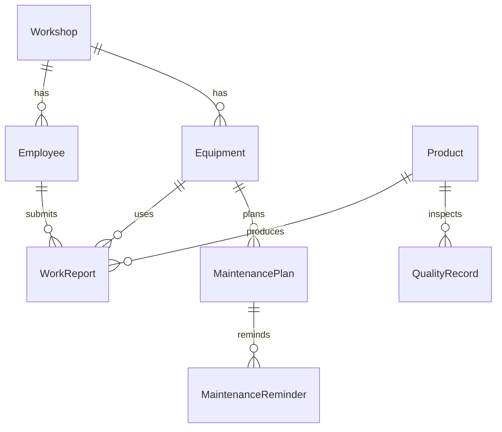

# Management CNC Workshop

CNC 数据车间管理系统后端 — **ASP.NET Core 8 单项目**，SQLite 数据库，供 UniApp 小程序调用。

## 快速启动（VS Code）

1. 用 VS Code 打开：`/Users/liaobin/Desktop/ManagementCNCWorkshop`
2. 安装推荐扩展：**C# Dev Kit** 或 **C#**
3. **首次**在终端执行（修复 NuGet 权限问题）：

```bash
cd /Users/liaobin/Desktop/ManagementCNCWorkshop
zsh scripts/restore.sh
```

4. 启动项目：

```bash
dotnet run --project src/ManagementCNCWorkshop.Api
```

5. 浏览器打开 Swagger：`http://localhost:5xxx/swagger`
6. 或按 **F5** 直接调试启动

### NuGet 报错 `Access to the path '/Users/liaobin/.local/share' is denied`？

原因是 `~/.local` 目录归 **root** 所有，NuGet 无法写入。两种修法任选其一：

**方案 A（推荐，一劳永逸）** — 修复本机权限：

```bash
zsh scripts/fix-nuget-permissions.sh
dotnet restore
```

**方案 B（不改系统目录）** — 把缓存放到项目里：

```bash
zsh scripts/restore.sh
```

项目已自带 `NuGet.config`，会把包缓存到 `.nuget/packages`。

首次启动会自动建库并写入演示数据（车间、员工、产品、设备、保养计划）。

> Swagger 页面已补充中文注释：每个接口、字段都有说明，重启后刷新 `/swagger` 即可看到。

## 项目完成度（重要）

**当前是 V1 初版 / MVP，不是最终成品。** 已完成和未完成如下：

| 状态 | 内容 |
|------|------|
| ✅ 已完成 | 8 张数据表、REST API、Swagger 文档、SQLite 本地库、演示数据、CORS（供 UniApp 调用） |
| ✅ 已完成 | 扫码报工、产量日/周/月统计、质量录入与统计、保养计划与提醒 |
| ❌ 未做 | 微信登录 + JWT 鉴权（接口目前无登录验证） |
| ❌ 未做 | UniApp 小程序前端 |
| ❌ 未做 | 工单管理、工位、不良类型字典、保养执行记录 |
| ❌ 未做 | 数据编辑/删除、分页、权限角色 |
| ❌ 未做 | 生产部署（SQL Server）、EF Migrations、定时任务、消息推送 |

**结论：后端骨架和核心接口已搭好，可以开始对接小程序；要上生产还需要继续迭代。**

## 项目结构

```
ManagementCNCWorkshop/
├── ManagementCNCWorkshop.sln
└── src/ManagementCNCWorkshop.Api/
    ├── Program.cs
    ├── Data/
    │   ├── AppDbContext.cs    # EF Core 数据库上下文
    │   └── DbSeed.cs          # 演示数据
    ├── Models/                # 8 张表实体
    └── Controllers/           # API 接口
```

## API 一览

| 功能 | 方法 | 路径 |
|------|------|------|
| 健康检查 | GET | `/api/health` |
| 车间列表/新增 | GET/POST | `/api/master/workshops` |
| 员工列表/新增 | GET/POST | `/api/master/employees` |
| 产品列表/新增 | GET/POST | `/api/master/products` |
| 扫码查产品 | GET | `/api/master/products/by-qrcode?code=PROD:P001` |
| 设备列表/新增 | GET/POST | `/api/master/equipments` |
| 扫码查设备 | GET | `/api/master/equipments/by-qrcode?code=EQ:CNC-01` |
| 扫码报工 | POST | `/api/work-reports/scan` |
| 报工列表 | GET | `/api/work-reports` |
| 产量日/周/月统计 | GET | `/api/stats/production/daily\|weekly\|monthly` |
| 录入质量记录 | POST | `/api/quality` |
| 质量日/周/月统计 | GET | `/api/quality/stats/daily\|weekly\|monthly` |
| 创建保养计划 | POST | `/api/maintenance/plans` |
| 待处理保养提醒 | GET | `/api/maintenance/reminders/pending` |
| 生成保养提醒 | POST | `/api/maintenance/reminders/generate` |

## 数据表设计（8 张）

| 表 | 用途 | 核心字段 |
|----|------|----------|
| `Workshops` | 车间 | Code, Name |
| `Employees` | 员工/小程序用户 | EmployeeNo, Name, WorkshopId, WeChatOpenId |
| `Products` | 产品/零件 | Code, Name, Specification, QrCode |
| `WorkReports` | 扫码报工 | ProductId, WorkshopId, EmployeeId, Quantity, QualifiedQty, DefectQty, ScanPayload |
| `QualityRecords` | 质量记录 | SampleQty, QualifiedQty, DefectQty, DefectType |
| `Equipments` | CNC 设备 | Code, Name, Status, LastMaintenanceDate, QrCode |
| `MaintenancePlans` | 保养计划 | CycleDays, NextDueDate, RemindDaysBefore, Content |
| `MaintenanceReminders` | 保养提醒 | DueDate, RemindDate, Status |

### 统计逻辑

- **产量统计**：从 `WorkReports` 按日/周/月实时聚合
- **质量统计**：从 `QualityRecords` 实时聚合，含合格率 `PassRate`
- **保养提醒**：调用 `POST /api/maintenance/reminders/generate` 根据计划自动生成

### 业务关系



## 演示数据

| 类型 | 示例 |
|------|------|
| 车间 | WS01 CNC一车间 |
| 员工 | E001 张三、E002 李四 |
| 产品 | P001 轴承座（QrCode: `PROD:P001`） |
| 设备 | CNC-01 五轴加工中心（QrCode: `EQ:CNC-01`） |

## 后续可扩展

- 微信登录 + JWT 鉴权（`WeChatOpenId` 字段已预留）
- 工单、工位、不良类型字典
- 统计汇总表 + 后台定时任务
- SQL Server 生产部署 + EF Migrations
